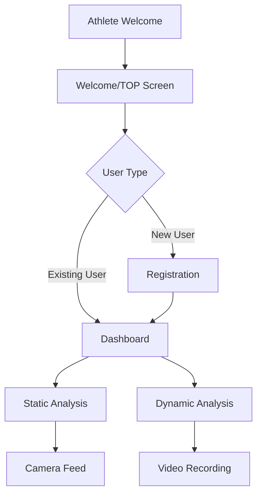

# AthleteCore Pro - AI姿勢分析システム

## プロジェクト概要
AthleteCore Proは、最先端のAI技術（MediaPipe Pose）を活用したモバイル対応の姿勢分析Webアプリケーションです。リアルタイムの姿勢検出により、アスリートのパフォーマンス向上をサポートします。

## 🏆 現在実装済みの機能

### ✅ 基本システム
- **統一初期化システム**: アプリケーション起動時の重複ロジックを解決し、安定したナビゲーションを実現
- **レスポンシブデザイン**: モバイルファースト設計で、すべてのデバイスに対応
- **PWA対応**: サービスワーカーによるオフライン対応とアプリインストール機能
- **多言語対応**: 日本語・英語の音声ガイダンス

### ✅ ユーザーフロー
1. **Athlete Welcome Screen** (`#athlete-welcome`): エレガントなエントリーポイント
2. **Welcome/TOP Screen** (`#welcome`): ユーザータイプに応じた分岐
3. **Registration Screen** (`#registration`): 新規ユーザー向け登録画面
4. **Dashboard** (`#dashboard`): メイン操作画面

### ✅ 姿勢分析機能
- **静的姿勢分析**: 写真撮影による姿勢の詳細分析
- **動的姿勢分析**: 動画撮影による動作の連続分析
- **MediaPipe Pose統合**: リアルタイム骨格検出
- **カメラ制御**: フロント/リアカメラ切り替え対応
- **🆕 人型ガイドシステム**: 正確な立ち位置ナビゲーション機能

### ✅ データ管理
- **ローカルストレージ**: ユーザーデータの永続化
- **スマートリロード**: アプリ状態の復元機能
- **分析結果保存**: 撮影データと分析結果の管理

## 🔗 アプリケーションフロー



## 📱 エントリーポイント (URIs)

- **メイン**: `index.html` - アプリケーションのエントリーポイント
- **Athlete Welcome**: `#athlete-welcome` - 初回アクセス画面
- **Welcome/TOP**: `#welcome` - ユーザー分岐画面
- **Registration**: `#registration` - 新規ユーザー登録
- **Dashboard**: `#dashboard` - メイン機能アクセス画面
- **Static Analysis**: `#static-analysis` - 静的姿勢分析
- **Dynamic Analysis**: `#dynamic-analysis` - 動的姿勢分析

## 🛠️ 技術スタック

- **Frontend**: HTML5, CSS3, JavaScript (ES6+)
- **AI/ML**: MediaPipe Pose Detection
- **PWA**: Service Worker, Web App Manifest
- **Audio**: Web Speech API, Audio Context API
- **Camera**: MediaDevices API, WebRTC
- **Storage**: LocalStorage, SessionStorage

## 🔧 最新の修正内容（モバイル結果画面表示問題対応）

### ✅ 解決済み問題
1. **初期化の重複問題**: 複数のload eventリスナーによる競合を統一初期化に集約
2. **ナビゲーションフロー**: Welcome画面からの分岐ロジックを修正
3. **デバッグ機能強化**: 全ての画面遷移に詳細なログ出力を追加
4. **カメラアクセス**: 撮影セクションへの移行を確実に実行
5. **🆕 モバイル結果画面表示**: 撮影後に結果画面が表示されない問題を解決

### 🔥 モバイル特化修正（最新）
#### showResults()関数の強化
- **強制表示CSS**: `position: fixed`, `z-index: 9999`, `!important`スタイル適用
- **モバイル検出**: デバイス判定による自動適用
- **段階的初期化**: 画面表示を優先し、コンテンツ読み込みを分離

#### 結果コンテンツのデバッグ強化
- **updateResultsDisplay()**: 各DOM要素の存在確認と詳細エラーハンドリング
- **createAnalysisChart()**: Chart.js読み込み状況とキャンバス要素の検証
- **モバイルデバッグパネル**: リアルタイム状態監視（15秒間表示）

#### 戻るボタンのモバイル対応
- **結果画面**: ダッシュボードへの適切な遷移
- **タッチイベント**: `touchstart`/`touchend`による確実な反応
- **視覚フィードバック**: スケール変換とカラー変更

### 🎯 人型ガイドシステム（NEW!）
#### インテリジェント位置合わせ
- **SVGベース人型シルエット**: 静的・動的分析用の最適化されたガイド
- **リアルタイム位置検出**: MediaPipe結果との自動比較・評価
- **スマート位置合わせスコア**: 水平・垂直位置、足幅の総合評価

#### ナビゲーション機能
- **音声ガイダンス**: 日本語による立ち位置の指示
- **視覚フィードバック**: カラーコード化された位置合わせステータス
- **ワンタップ切り替え**: 人型ガイドの表示/非表示制御

#### モバイル最適化
- **レスポンシブSVG**: 全画面サイズに自動適応
- **タッチ操作対応**: 44px以上のボタンサイズ確保
- **パフォーマンス最適化**: 軽量描画とスムーズなアニメーション

### ✅ フロー修正
- **新規ユーザー**: `athlete-welcome` → `welcome` → `registration` → `dashboard`
- **既存ユーザー**: `athlete-welcome` → `welcome` → `dashboard` (登録スキップ)
- **撮影フロー**: `dashboard` → `static/dynamic-analysis` → **`results`** (修正完了)

## 🚀 推奨される次のステップ

### 1. 高優先度
- [x] **モバイル結果画面**: 撮影後の結果表示問題を解決 ✅
- [x] **人型ガイドシステム**: 正確な立ち位置ナビゲーション実装 ✅
- [ ] **実機テスト**: 人型ガイド含む全フローの実機確認
- [ ] **MediaPipe最適化**: 姿勢検出の精度向上
- [ ] **エラーハンドリング**: カメラアクセス失敗時のフォールバック

### 2. 中優先度  
- [ ] **UI/UX改善**: アニメーション効果の最適化
- [ ] **パフォーマンス**: 初期読み込み時間の短縮
- [ ] **分析結果UI**: より視覚的な結果表示

### 3. 将来的な拡張
- [ ] **クラウド連携**: 分析結果のクラウド保存
- [ ] **AIモデル改良**: より高精度な姿勢分析
- [ ] **チーム機能**: 複数ユーザー管理とデータ共有

## 📊 データ構造

### ユーザーデータ
```javascript
{
  name: string,
  height: number,
  weight: number,
  sport: string,
  level: string,
  created_at: timestamp
}
```

### 分析データ
```javascript
{
  type: 'static' | 'dynamic',
  timestamp: number,
  landmarks: Array,
  analysis_results: Object,
  user_id: string
}
```

## 🐛 デバッグ機能

アプリケーションには包括的なデバッグシステムが組み込まれています：

- **画面遷移ログ**: 全てのnavigationを追跡
- **ユーザー状態**: 既存/新規ユーザーの判定過程
- **カメラ初期化**: デバイスアクセスの詳細ログ
- **MediaPipe状態**: AI初期化とエラー情報
- **🆕 モバイルデバッグパネル**: リアルタイム状態監視（画面上に表示）

### コンソールログパターン
- `🏆 FLOW:` - 画面遷移情報
- `👤 User status:` - ユーザー状態
- `📸 CAMERA:` - カメラ関連操作
- `🔄 Transition:` - 画面間の移行
- `📱 Mobile:` - モバイル特化の表示制御
- `📊 Results:` - 結果画面とチャート生成
- `🎯 Debug Panel:` - モバイルデバッグパネル情報

### モバイル専用デバッグ
- **リアルタイム監視**: 画面上に状態情報を15秒間表示
- **タッチイベント追跡**: ボタンタップの詳細ログ
- **DOM要素検証**: 各画面の要素存在確認
- **CSS強制適用**: モバイルでの表示問題の診断情報

## 🔒 セキュリティとプライバシー

- **ローカル処理**: 全ての画像/動画処理はデバイス内で完結
- **データ保護**: ユーザーデータのローカル暗号化
- **権限管理**: カメラ・マイクアクセスの適切な制御

---

**開発者**: BCLab Corporation  
**最終更新**: 2025年9月29日  
**バージョン**: 1.2 (人型ガイドシステム実装完了)  
**ライセンス**: Proprietary

### 🔥 機能追加ログ
- **2025-09-29 v1.2**: 人型ガイドシステムの完全実装
  - SVGベースの人型シルエットガイド（静的・動的分析対応）
  - MediaPipe検出結果との自動位置合わせ評価システム
  - 音声による立ち位置ナビゲーション（日本語対応）
  - ワンタップでの表示切り替え機能
  - モバイル環境での完全最適化

- **2025-09-29 v1.1**: モバイル環境での結果画面表示問題を解決
  - `showResults()`関数にモバイル特化の強制表示ロジック追加
  - 結果コンテンツ表示の包括的エラーハンドリング実装
  - モバイルデバッグパネルによるリアルタイム診断機能追加
  - 戻るボタンのモバイルタッチイベント対応強化
