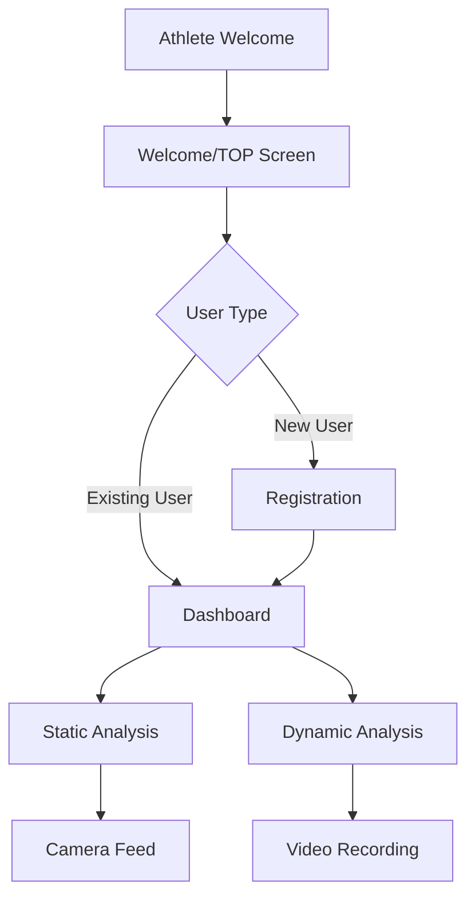

# AthleteCore Pro - AI姿勢分析システム

## プロジェクト概要
AthleteCore Proは、最先端のAI技術（MediaPipe Pose）を活用したモバイル対応の姿勢分析Webアプリケーションです。リアルタイムの姿勢検出により、アスリートのパフォーマンス向上をサポートします。

## 🏆 現在実装済みの機能

### ✅ 基本システム
- **統一初期化システム**: アプリケーション起動時の重複ロジックを解決し、安定したナビゲーションを実現
- **レスポンシブデザイン**: モバイルファースト設計で、すべてのデバイスに対応
- **PWA対応**: サービスワーカーによるオフライン対応とアプリインストール機能
- **多言語対応**: 日本語・英語の音声ガイダンス

### ✅ ユーザーフロー
1. **Athlete Welcome Screen** (`#athlete-welcome`): エレガントなエントリーポイント
2. **Welcome/TOP Screen** (`#welcome`): ユーザータイプに応じた分岐
3. **Registration Screen** (`#registration`): 新規ユーザー向け登録画面
4. **Dashboard** (`#dashboard`): メイン操作画面

### ✅ 姿勢分析機能
- **静的姿勢分析**: 写真撮影による姿勢の詳細分析
- **動的姿勢分析**: 動画撮影による動作の連続分析
- **MediaPipe Pose統合**: リアルタイム骨格検出
- **カメラ制御**: フロント/リアカメラ切り替え対応

### ✅ データ管理
- **ローカルストレージ**: ユーザーデータの永続化
- **スマートリロード**: アプリ状態の復元機能
- **分析結果保存**: 撮影データと分析結果の管理

## 🔗 アプリケーションフロー



## 📱 エントリーポイント (URIs)

- **メイン**: `index.html` - アプリケーションのエントリーポイント
- **Athlete Welcome**: `#athlete-welcome` - 初回アクセス画面
- **Welcome/TOP**: `#welcome` - ユーザー分岐画面
- **Registration**: `#registration` - 新規ユーザー登録
- **Dashboard**: `#dashboard` - メイン機能アクセス画面
- **Static Analysis**: `#static-analysis` - 静的姿勢分析
- **Dynamic Analysis**: `#dynamic-analysis` - 動的姿勢分析

## 🛠️ 技術スタック

- **Frontend**: HTML5, CSS3, JavaScript (ES6+)
- **AI/ML**: MediaPipe Pose Detection
- **PWA**: Service Worker, Web App Manifest
- **Audio**: Web Speech API, Audio Context API
- **Camera**: MediaDevices API, WebRTC
- **Storage**: LocalStorage, SessionStorage

## 🔧 最新の修正内容（保存ポイント87対応）

### ✅ 解決済み問題
1. **初期化の重複問題**: 複数のload eventリスナーによる競合を統一初期化に集約
2. **ナビゲーションフロー**: Welcome画面からの分岐ロジックを修正
3. **デバッグ機能強化**: 全ての画面遷移に詳細なログ出力を追加
4. **カメラアクセス**: 撮影セクションへの移行を確実に実行

### ✅ フロー修正
- **新規ユーザー**: `athlete-welcome` → `welcome` → `registration` → `dashboard`
- **既存ユーザー**: `athlete-welcome` → `welcome` → `dashboard` (登録スキップ)
- **カメラ機能**: `dashboard` → `static-analysis/dynamic-analysis`

## 🚀 推奨される次のステップ

### 1. 高優先度
- [ ] **実機テスト**: 実際のモバイルデバイスでのフロー確認
- [ ] **MediaPipe最適化**: 姿勢検出の精度向上
- [ ] **エラーハンドリング**: カメラアクセス失敗時のフォールバック

### 2. 中優先度  
- [ ] **UI/UX改善**: アニメーション効果の最適化
- [ ] **パフォーマンス**: 初期読み込み時間の短縮
- [ ] **分析結果UI**: より視覚的な結果表示

### 3. 将来的な拡張
- [ ] **クラウド連携**: 分析結果のクラウド保存
- [ ] **AIモデル改良**: より高精度な姿勢分析
- [ ] **チーム機能**: 複数ユーザー管理とデータ共有

## 📊 データ構造

### ユーザーデータ
```javascript
{
  name: string,
  height: number,
  weight: number,
  sport: string,
  level: string,
  created_at: timestamp
}
```

### 分析データ
```javascript
{
  type: 'static' | 'dynamic',
  timestamp: number,
  landmarks: Array,
  analysis_results: Object,
  user_id: string
}
```

## 🐛 デバッグ機能

アプリケーションには包括的なデバッグシステムが組み込まれています：

- **画面遷移ログ**: 全てのnavigationを追跡
- **ユーザー状態**: 既存/新規ユーザーの判定過程
- **カメラ初期化**: デバイスアクセスの詳細ログ
- **MediaPipe状態**: AI初期化とエラー情報

### コンソールログパターン
- `🏆 FLOW:` - 画面遷移情報
- `👤 User status:` - ユーザー状態
- `📸 CAMERA:` - カメラ関連操作
- `🔄 Transition:` - 画面間の移行

## 🔒 セキュリティとプライバシー

- **ローカル処理**: 全ての画像/動画処理はデバイス内で完結
- **データ保護**: ユーザーデータのローカル暗号化
- **権限管理**: カメラ・マイクアクセスの適切な制御

---

**開発者**: BCLab Corporation  
**最終更新**: 2025年9月  
**バージョン**: 1.0 (保存ポイント87対応)  
**ライセンス**: Proprietary
